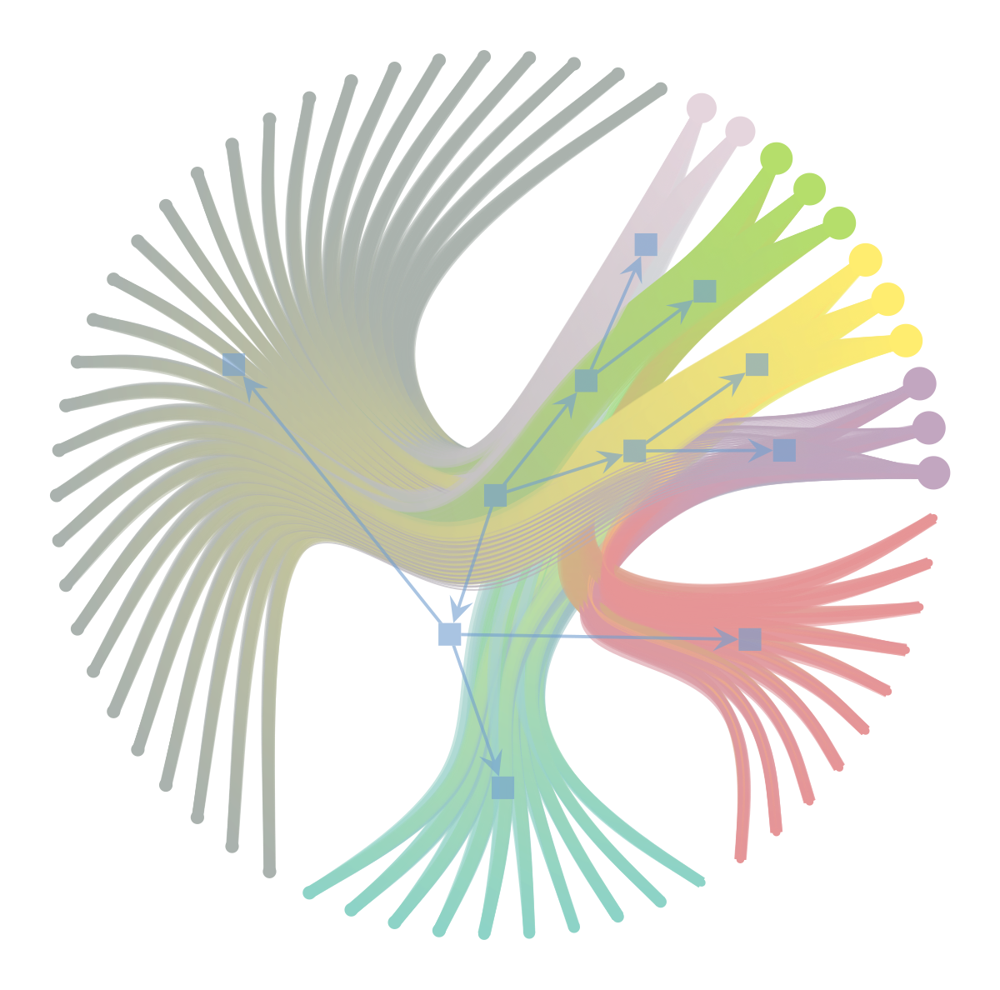

[](https://zenodo.org/badge/latestdoi/333831359)
[](https://trisbm.readthedocs.io/en/latest/?badge=latest)
[](https://github.com/fvalle1/trisbm/actions/workflows/python-package.yml)
[](https://github.com/fvalle1/nsbm/actions/workflows/miniconda.yml)
[](https://github.com/fvalle1/trisbm/actions/workflows/docker.yml)
[](https://anaconda.org/conda-forge/nsbm)
[](LICENSE)

# multipartite Stochastic Block Modeling

Inheriting hSBM from [https://github.com/martingerlach/hSBM_Topicmodel](https://github.com/martingerlach/hSBM_Topicmodel) extends it to tripartite networks (aka supervised topic models)

The idea is to run SBM-based topic modeling on networks given keywords on documents



# Install
## With pip
```bash
python3 -m pip install . -vv
```


## With conda/mamba

```bash
conda install -c conda-forge nsbm
```


# Example
```python
from nsbm import nsbm
import pandas as pd
import numpy as np

df = pd.DataFrame(
index = ["w{}".format(w) for w in range(1000)],
columns = ["doc{}".format(d) for d in range(250)],
data = np.random.randint(1, 100, 250000).reshape((1000, 250)))

df_key_list = []

## keywords
df_key_list.append(
    pd.DataFrame(
    index = ["keyword{}".format(w) for w in range(100)],
    columns = ["doc{}".format(d) for d in range(250)],
    data = np.random.randint(1, 10, (100, 250)))
)
    
## authors
df_key_list.append(
    pd.DataFrame(
    index = ["author{}".format(w) for w in range(10)],
    columns = ["doc{}".format(d) for d in range(250)],
    data = np.random.randint(1, 5, (10, 250)))
)
    
## other features
df_key_list.append(
    pd.DataFrame(
    index = ["feature{}".format(w) for w in range(25)],
    columns = ["doc{}".format(d) for d in range(250)],
    data = np.random.randint(1, 5, (25, 250)))
)

model = nsbm()
model.make_graph_multiple_df(df, df_key_list)

model.fit(n_init=1, B_min=50, verbose=False)
model.save_data()
```


# Run with Docker

```bash
docker run -it -u jovyan -v $PWD:/home/jovyan/work -p 8899:8888 docker.pkg.github.com/fvalle1/trisbm/trisbm:latest
```

If a *graph.xml.gz* file is found in the current dir the analysis will be performed on it.

# Tests

```bash
python3 tests/run_tests.py
```

# Documentation

[Docs](https://fvalle1.github.io/nsbm/)

[Readthedocs](https://trisbm.readthedocs.io/en/latest/index.html)

# License

See [LICENSE](LICENSE).

This work [is in part based on](https://www.gnu.org/licenses/gpl-faq.en.html#WhyDoesTheGPLPermitUsersToPublishTheirModifiedVersions) [sbmtm](https://github.com/martingerlach/hSBM_Topicmodel)

## Third party libraries

This package depends on [graph-tool](https://graph-tool.skewed.de)
