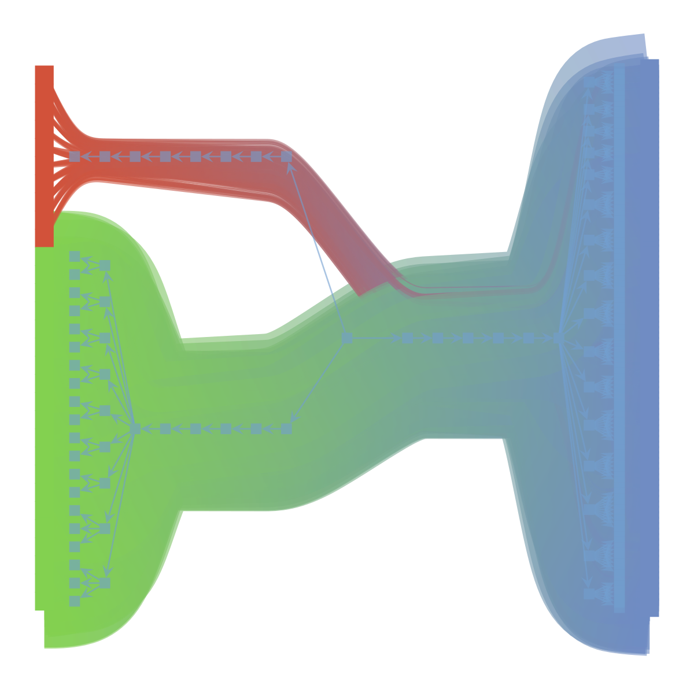

# tripartite Stochastic Block Modeling

Similar to [https://github.com/martingerlach/hSBM_Topicmodel](https://github.com/martingerlach/hSBM_Topicmodel) but with tripartite networks

The idea is to run SBM-based topic modeling on networks given keywords on documents



# Run

```bash
docker build -t trisbm .
docker run -it -u jovyan -v $PWD:/home/jovyan -p 8888:8888 trisbm
```
